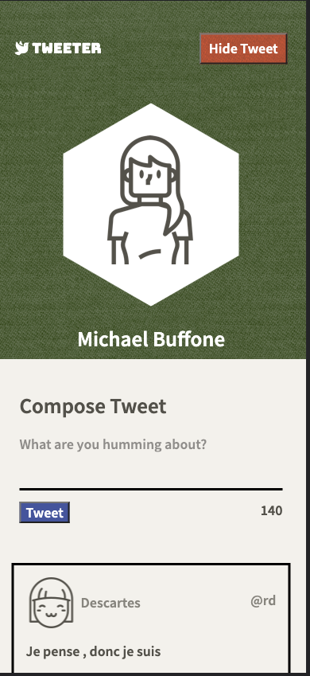
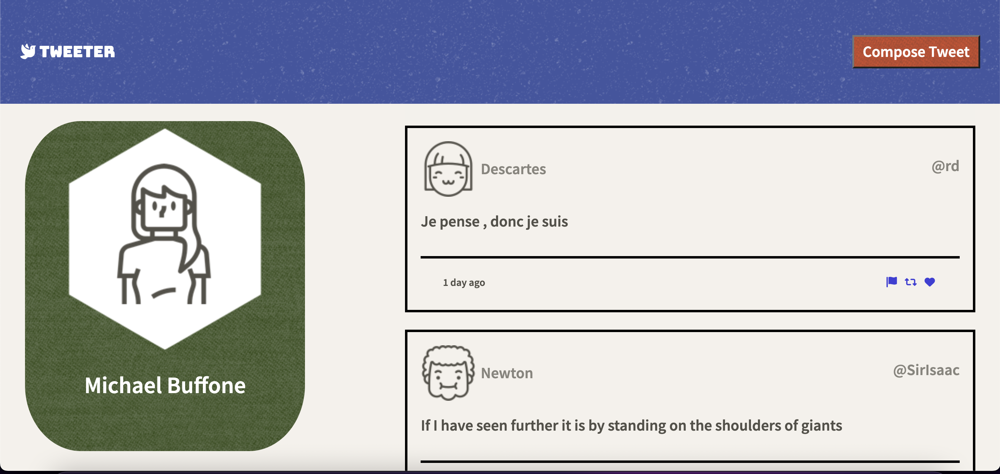
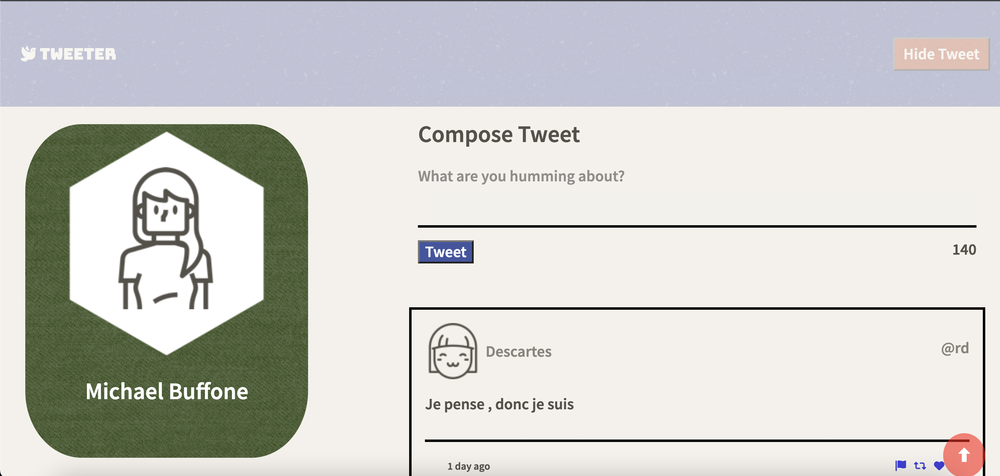

# Tweeter Project

Tweeter is a simple, single-page Twitter clone.

## Final Product
Mobile

Desktop

Desktop Scrolled 

## Features
* Dynamic character counter to show how many characters left of 140.
* Toggle Compose Tweet section open and close
* Compose tweet button scrolls to section of page
* After scrolling you get a back to top button on bottom of page
* When scrolling navbar becomes tranparent

## Getting Started

1. Fork this respository, then clone repository onto your local device.
2. Install dependencies using the `npm install` command.
3. Start the web server using the `npm run local` command. The app will be served at <http://localhost:8080/>.
4. Go to <http://localhost:8080/> in your browser.

## Dependencies

- Express
- Node 5.10.x or above
